# Taller 8

### Bases de Datos en la Nube - RDS

##### Analítica Computacional para la Toma de Decisiones

---

|     Nombres      |      Apellidos       |     Login     |  Codigo   |
| :--------------: | :------------------: | :-----------: | :-------: |
|     Santiago     | Gonzalez Montealegre | s.gonzalez35  | 202012274 |
| Juliana Carolina |  Cardenas Barragan   | jc.cardenasb1 | 202011683 |

---

---

## Pre-requisitos

---

1. Para esta sesión va a requerir una cuenta de Amazon Web Services - AWS. Para esto hay varias opciones:

   - Utilizar una cuenta propia ya creada.

   - Crear una cuenta nueva. En este caso recuerde que requiere ingresar datos de una tarjeta de crédito. Usaremos recursos disponibles en la capa gratuita (https://aws.amazon.com/free/), pero es posible que se generen algunos costos menores.

   - Usar la cuenta de acceso limitado enviada a su correo por el instructor.

1. Ingrese a su cuenta y familiarícese con la consola.

1. Asegúrese de que en la esquina superior derecha aparezca la región N. Virginia.

1. Nota: la entrega de este taller consiste en un reporte y unos archivos de soporte. Cree el archivo de su reporte como un documento de texto en el que pueda fácilmente incorporar capturas de pantalla, textos y similares. Puede ser un archivo de word, libre office, markdown, entre otros.

1. Nota 2: Los siguientes pasos deben ser realizados por cada miembro del grupo y el reporte debe incluir los soportes de todos. En la parte final se pide que cada uno se conecte a la base de datos lanzada por uno de sus compañeros.

---

**Nota:**
Para los screenshots se utilizará la notación

- `S:` Santiago González
- `J:` Juliana Cárdenas

---

## Lance una instancia de RDS: relational database service

---

### 1.

En la consola de AWS ubique el servicio RDS y vaya al Dashboard. De click en Bases de Datos Databases y en Crear base de datos.

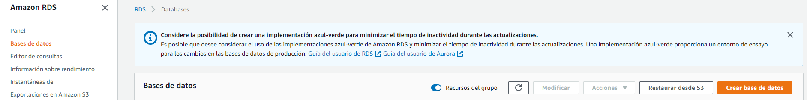

---

### 2.

Seleccione Creación estándar, PostgreSQL, versión 14. Seleccione ambiente de Capa gratuita.

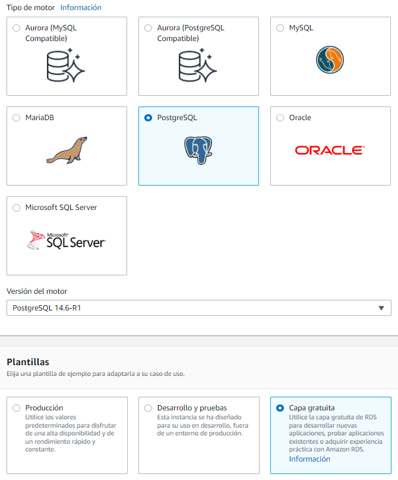

---

### 3.

En Configuración defina un nombre para la instancia de su base de datos usando su primer nombre.

- **S:**

  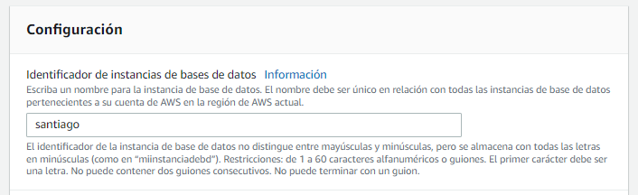

- **J:**

  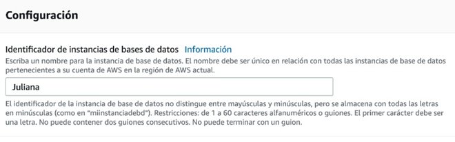

---

### 4.

El usuario maestro puede dejarlo como postgres.

---

### 5.

Defina una contraseña maestra que recuerde fácilmente.

- S: `santiago2003`

- J: `Juliana200228`

---

### 6.

Seleccione instancias con ráfagas y específicamente una `db.t3.micro`.

---

### 7.

Para almacenamiento seleccione un disco SSD de 20 GB. Permita autoscaling del almacenamiento.

---

### 8.

En Conectividad deje las opciones iniciales por defecto, hasta el grupo de subred.

---

### 9.

En Acceso Público marque sí.

---

### 10.

En Grupo de seguridad de VPC, cree uno nuevo, use su nombre.

- **S:**
  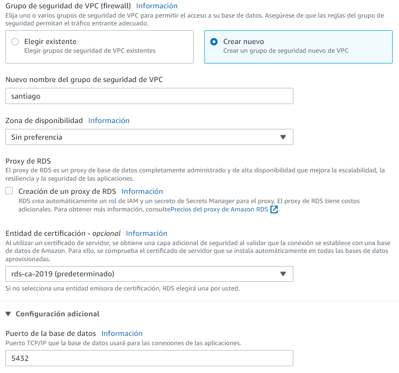

- **J:**
  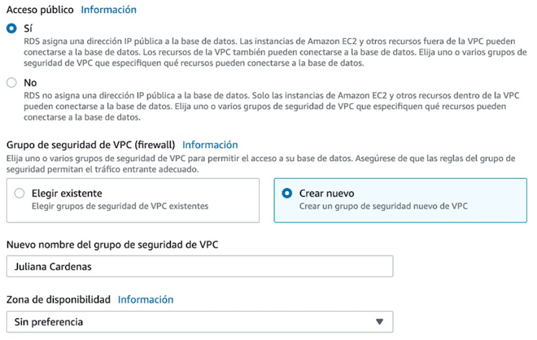

---

### 11.

Deje sin preferencia la Zona de disponibilidad. En puerto (configuración adicional) de la base de datos deje el 5432 (por defecto).

---

### 12.

Permita la Autenticación con contraseña.

---

### 13.

Deje las demás opciones en sus valores por defecto hasta Supervisión.

---

### 14.

En Configuración adicional defina un nombre para la base de datos inicial. Puede usar por ejemplo postgres o un nombre de fácil recordación.

- **S:**

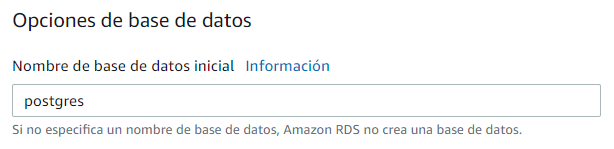

- **J:**

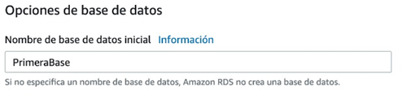

---

### 15.

Deje las demás opciones en sus valores por defecto.

---

### 16.

Como referencia, tome un pantallazo de los costos mensuales estimados e inclúyalo en su reporte.

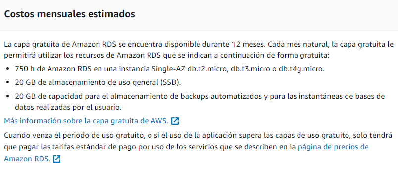

---

### 17.

En RDS, vaya a Bases de datos y cuando termine de crearse, identifique el endpoint y el puerto. Tome un pantallazo de la consola de RDS donde se vea claramente la base de datos con el endpoint e inclúyalo en su reporte.

- **S:**
  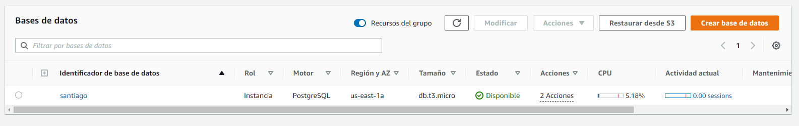

  - Endpoint: `santiago.cbcppu1qhnbp.us-east-1.rds.amazonaws.com`
  - Puerto: 5432
    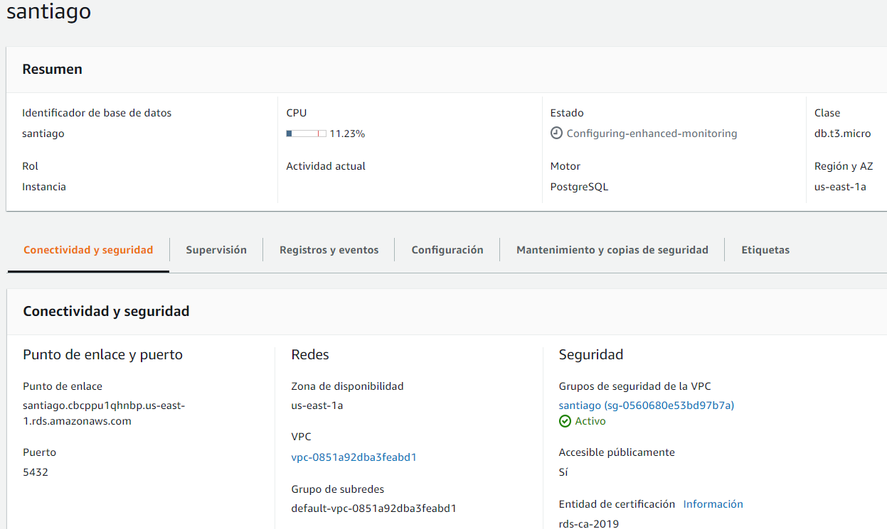

- **J:**
  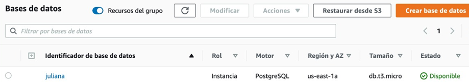
  - Endpoint: `juliana.cdrz11epbroh.us-east-1.rds.amazonaws.com/`
  - Puerto: 5432
    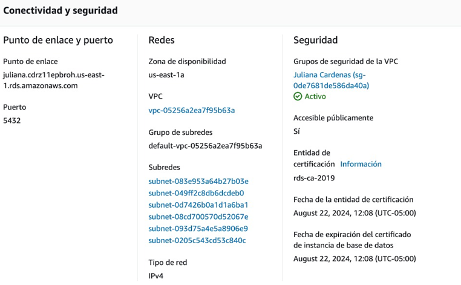

---

### 18.

Conéctese a su base de datos desde un script o cuaderno de python local y consulte las tablas disponibles en la base de datos. Necesitará un código de conexión como éste.

```py
import psycopg2
engine = psycopg2.connect(
    dbname="postgres",
    user="my_user_name",
    password="123123123",
    host="my-rds-instance-name.123456.us-east-1.rds.amazonaws.com",
    port='5432'
)
```

Tome un pantallazo e inclúyalo en su reporte.

- **S:**
  

- **J:**
  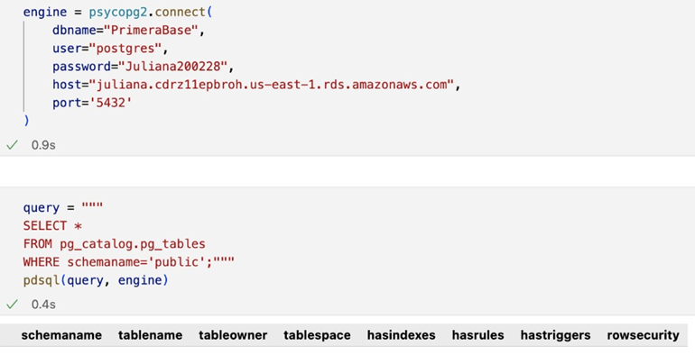

No hay tablas disponibles

---

---

## Crear base de datos y alimentarla con un script

---

Los siguientes pasos se realizan desde una instancia EC2 para garantizar su ejecución. Puede realizar pasos similares desde su equipo local, de acuerdo con el sistema operativo y permisos que tenga.

---

### 1.

Lance una instancia t2.micro de EC2 con Amazon Linux.

- **S:**
  IP: `100.26.235.0`
  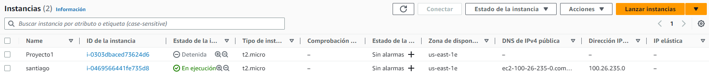
- **J:**
  IP: `18.209.211.96`
  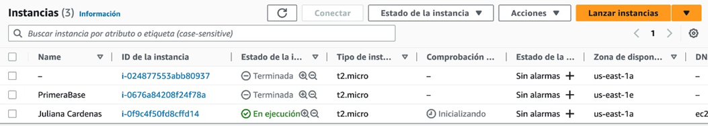

---

### 2.

En su directorio home (`/home/ec2-user/`) cree una carpeta data con el comando

```shell
mkdir data
```

Conexión:

```shell
ssh -i llave.pem ec2-user@ip
```

---

### 3.

Desde su equipo local copie el archivo world.sql en su instancia usando en comando

```shell
scp -i llave.pem world.sql ec2-user@IP:/home/ec2-user/data
```

- **S:**
  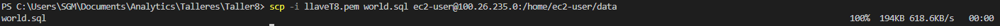
  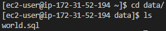

- **J:**
  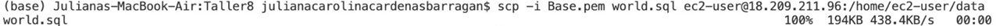
  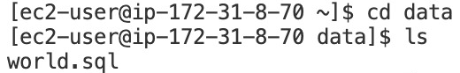

---

### 4.

Los siguientes pasos son desde la consola de la instancia Linux en EC2.

---

### 5.

Agregue el repositorio de PostgreSQL 13 disponible para el manejador de paquetes yum, usando el siguiente código en la consola de Linux

```shell
sudo tee /etc/yum.repos.d/pgdg.repo<<EOF
[pgdg13]
name=PostgreSQL 13 for RHEL/CentOS 7 - x86_64
baseurl=https://download.postgresql.org/pub/repos/yum/13/redhat/rhel-7-x86_64
enabled=1
gpgcheck=0
EOF
```

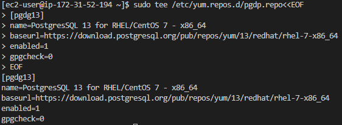

---

### 6.

Actualice los repositorios de paquetes con el comando

```shell
sudo yum update
```

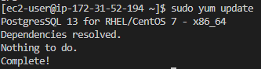

---

### 7.

Ahora sí instale el client y servidor de PostgreSQL 13

```shell
sudo yum install postgresql13 postgresql13-server
```

```shell
sudo yum install postgresql13 postgresql13-server --skip-broken
```

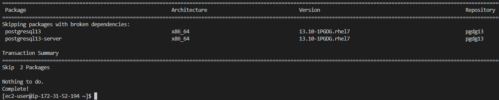

---

### 8.

Usando este cliente puede conectarse a la BD en RDS con PSQL, así

```shell
psql --host=endpoint.rds.amazonaws.com --port=5432 --username=postgres --password
```

modificando la dirección del endpoint, el puerto y el usuario por los adecuados, e ingresando su contraseña como la definió al crear la instancia de RDS.

---

### 9.

En este momento debe estar conectado a la BD postgres (o la principal que haya creado) en su servidor RDS. Para crear una nueva base de datos de nombre world use el comando

```shell
CREATE DATABASE world WITH ENCODING 'LATIN1';
```

---

### 10.

Conéctese a la base de datos con el comando

```shell
\c covid
```

---

### 11.

Ejecute el script .sql que sibió a la instancia con el comando

```shell
\i '/home/ec2-user/data/world.sql'
```

---

### 12.

Liste las tablas disponibles en la base de datos con el comando

```shell
\dt
```

---

### 13.

Tome un pantallazo e inclúyalo en su reporte.

---

### 14.

Conéctese ahora desde un script local de python y ejecute algunas consultas. Tome un pantallazo e inclúyalo en su reporte.

---

### 15.

Conéctese ahora desde un script local de python a la base de datos de su compañero/a y ejecute algunas consultas. Tome un pantallazo e inclúyalo en su reporte.

---

### 15.

En su entrega incluya el archivo .py o .ipynb usado en las conexiones.
